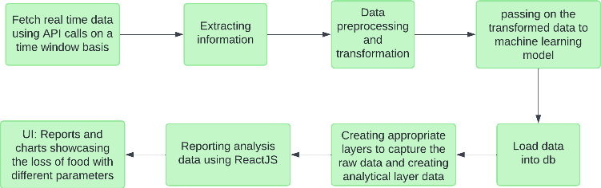

# Prevention of Food Wastage by Improving Supply Chain Process

## Overview
This project addresses the issue of food wastage in the supply chain by leveraging machine learning and IoT. The goal is to enable real-time monitoring and predictive analysis of food spoilage. This repository contains the **frontend application**, which provides an intuitive interface for visualizing real-time and historical data, spoilage predictions, and actionable insights.

---

## Architecture

<div align="center" >
    
    <h3>Architecture</h3>
</div>
The system architecture integrates IoT sensors, a backend processing system, and a frontend application to provide a seamless flow of data and insights. IoT sensors monitor critical metrics such as temperature, humidity, and gas emissions during the transportation and storage of food, collecting data at regular intervals. The backend, built with Python, preprocesses this sensor data and applies machine learning models like Random Forest to predict spoilage likelihood, storing the processed results in a MySQL database. The frontend, developed using ReactJS, retrieves this data via APIs and presents it through an intuitive user interface featuring dynamic visualizations, predictive dashboards, and historical trend analysis. This cohesive setup ensures stakeholders can make data-driven decisions to minimize food wastage and optimize supply chain efficiency.

---

## Features
- **Dynamic Data Visualization:** Interactive charts and graphs displaying temperature, humidity, and gas metrics.
- **Prediction Dashboard:** Simplifies spoilage predictions with scores or percentages.
- **Historical Data Insights:** Identifies recurring patterns and trends to optimize decision-making.
- **User Access Management:** Role-based access for different organizational levels.
- **Data Export:** Enables exporting insights and reports to CSV or Excel.
- **API Integration:** Seamlessly integrates with third-party applications.

---

## Technologies Used
- **ReactJS:** Framework for building responsive and interactive user interfaces.
- **Chart.js:** Library for dynamic and engaging data visualizations.
- **Axios:** For API communication with the backend.
- **CSS Modules:** For modular and maintainable styling.

---

## Prerequisites
Ensure the following are installed on your system:
- Node.js (v14 or later)
- npm (v6 or later)

---

## Installation
1. Clone the repository:
   ```bash
   git clone https://github.com/sriramsridhar26/FoodTrackingDashboard.git
   ```
2. Navigate to the project directory:
   ```bash
   cd foodtrackingdashboard
   ```
3. Install dependencies:
   ```bash
   npm install
   ```

---

## Running the Application
1. Start the development server:
   ```bash
   npm run dev
   ```
2. Open your browser and navigate to:
   ```
   http://localhost:5173
   ```

---

## Deployment
For production deployment:
1. Build the project:
   ```bash
   npm run build
   ```
2. Serve the `dist/` folder on a web server of your choice.


## Acknowledgments
Developed as part of the **Advanced Database Topics** course at the University of Windsor, Winter 2024.

For inquiries, please contact:
- Sriram Sridhar - `sriramsridhar26@gmail.com`
